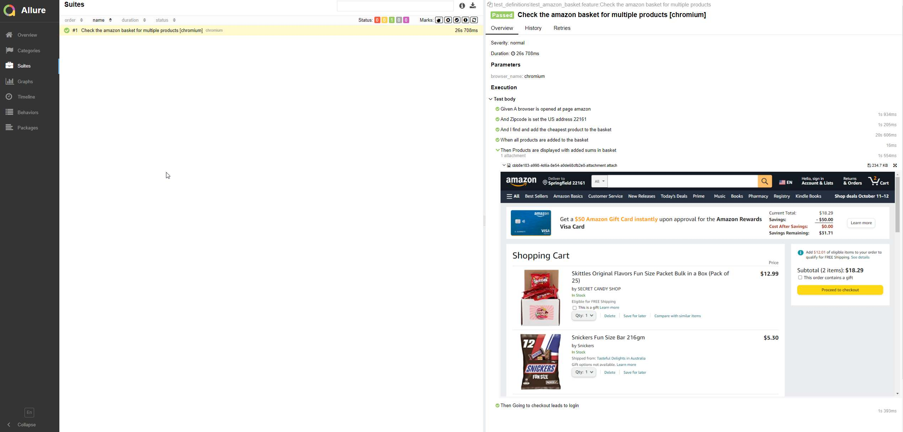

# Pytest plugin for Playwright 
[](https://pypi.org/project/pytest-playwright/)

Write end-to-end tests for your web apps with [Playwright](https://github.com/microsoft/playwright-python) 
(Syntax, Testrecorder and Webbrowser Speed) and [pytest](https://docs.pytest.org/en/stable/) 
(full functionality e.g. [Gherkin Syntax](https://pytest-bdd.readthedocs.io/en/latest/#organizing-your-scenarios) and pytest organisation).

- Support for **all modern browsers** including Chromium, WebKit and Firefox.
- Support for **headless and headed** execution.
- **Built-in fixtures** that provide browser primitives to test functions.

## Installation
1. Clone Repo
2. Create Virtual Environment
   - ``python -m venv pytest_venv``
   ``.\pytest_venv\Scripts\activate``
3. Install all dependencies for execution
   - ``pip install -r requirements.txt``
4. ``playwright install`` (to initialize the playwright browser setup)
4. Test with 
   -``pytest``
5. This environment is configured to run headed, with a slight delay, ignoring the second playwright test


## Development
The `pytest-playwright` plugin takes care of browser instantiation automatically with the following fixtures:

* The `browser` fixture provides the browser instance launched by Playwright.
* The `context` fixture provides a new browser context for a test.
* The `page` fixture provides a new browser page for a test.

## Documentation
See on [playwright.dev](https://playwright.dev/python/docs/test-runners) for examples and more detailed information.

Quick Overview - CLI arguments
- ``--headed``: Run tests in headed mode (default: headless).
- ``--browser``: Run tests in a different browser chromium, firefox, or webkit.
It can be specified multiple times (default: all browsers).
- ``--browser-channel`` Browser channel to be used.
- ``--slowmo`` Run tests with a delay between each step.
- ``--device`` Device to be emulated.
- ``--output`` Directory for artifacts produced by tests (default: test-results). 
- ``--tracing param`` Whether to record a trace for each test. on, off, or retain-on-failure (default: off).
- ``--video on/off/retain-on-failure`` Whether to record video for each test. on, off, or retain-on-failure (default: off).
- ``--screenshot`` Whether to automatically capture a screenshot after each test. 
on, off, or only-on-failure (default: off).

Check out [Gherkin Reference](https://cucumber.io/docs/gherkin/reference/) to write better .feature files

### Run tests
1. 
   ``pytest --browser chromium --headed``
2. `` playwright`` to see all options

## Enable running on multiple instances
1 Change the config file to desired number of instances


#### Examples for test-structures 
For more examples visit: https://github.com/cmoir/playwright_pytest_bdd_example


##  How to Configure Pytest
### Define commandline arguments
> use a pytest.ini
- file is at the root of the folder
- in this project all possible parameters are included, commented and disabled by hashes
- you can define parameters by default that would be otherwise be passed in the commandline
Example:
- Commandline:``pytest -parameter argument``
- pytest.ini :
````
[pytest]
addopts =  -parameter argument
````
- Defining which test should be called:
````
[pytest]
testpaths = my_test_path
python_files = my_test_file
python_classes = my_test_class
python_functions = my_test_function
markers =  my_marker
 ````
- exclude tests:

````
pytest --ignore-glob '*playwright*' # ignore any file, class etc, that has 'playwright' in it
````

> You can use * as wildcard in the pytest.ini

For detailed info: [Pytest - commandline options](https://docs.pytest.org/en/7.1.x/example/simple.html)

## Using conftest.py
###  Scope of confest
1. You can have multiple configs (conftest.py) in each folder to define their scope
2. Every colliding definition  will override the root definition

### Use Cases

#### Fixtures: 
Define fixtures for static data used by tests. This data can be accessed by all tests in the suite unless specified otherwise. 
These functions with the @fixture could be data, variables as well as helper functions of modules which will be passed to all tests.

#### Hooks
You can specify hooks such as setup and teardown methods and much more to improve your tests. 
For a set of available hooks, read [Pytests Docu on Hooks](https://docs.pytest.org/en/6.2.x/reference.html#hooks) 
Example:

  ```
  def pytest_runtest_setup(item):
      #called before 'pytest_runtest_call(item)'
      print("Print this in every directory")
  ```

#### Test root path
By defining conftest.py in your root path, you will have pytest recognizing your application modules without specifying PYTHONPATH. 
In the background, py.test modifies your sys.path by including all submodules which are found from the root path.


## Debugging
## Show traces
``pytest --full-trace``

## Playwright Inspector
https://playwright.dev/python/docs/debug#playwright-inspector

Start the inspector and go through your test stepwise with:
- Bash: ``PWDEBUG=1; pytest -s``
- Powershell ``$env:PWDEBUG=1 <Enter> pytest -s``
- Batch/ CMD: ``set PWDEBUG=1 <Enter> pytest -s`` 

(if e.g in CMD echo %PWDEBUG% returns 1 then ``pytest`` starts with inspector/debugger!!)

# Reporting
## Html -  single file reports

1. package pytest-html is provided with the requirements of this project
2. add the flag --html=filename.html and the report will be saved in the specified file and path
   ``pytest --html=myreportname.html``
> Visit [pytest-html](https://pytest-html.readthedocs.io/en/latest/) for configuration details

### Video Recording
1. in the pytest.ini add the option ``--output``
2. Result will be saved in folder "test-results" if no directory is specified
3. An example is in "results"

### Allure
#### Allure Installation Windows - Powershell
Install scoop installation manager
1. ``Set-ExecutionPolicy RemoteSigned -Scope CurrentUser`` # Optional: Needed to run a remote script the first time
2. ``irm get.scoop.sh | iex``

Install allure:
3. ``scoop install allure``

> If there is a problem with a JAVA_HOME directory not found: run in the same terminal ``scoop bucket add extras``
then ``scoop install find-java``. After you restart the commandline ``allure --version`` should return just a number.

### Save an allure report
`` pytest --alluredir=/relative_path/my_allure_results``

### Display allure output
``allure serve /path/to/allure_output_folder``

### Configure Allure
Allure records all BDD steps and function calls.

To define a function, that can be used by your tests. This is an example
````
import allure

@allure.step
def show_in_report(arg1, arg2):
    assert arg1 == arg2
````

To attch more information in the report, visit the [Allure Report Documentation](https://docs.qameta.io/allure-report/#_attachments_5)

#### Example Screenshot


### Other options
[Browserstack - HowTo integrate playwright](https://www.browserstack.com/docs/automate/playwright#Python)
